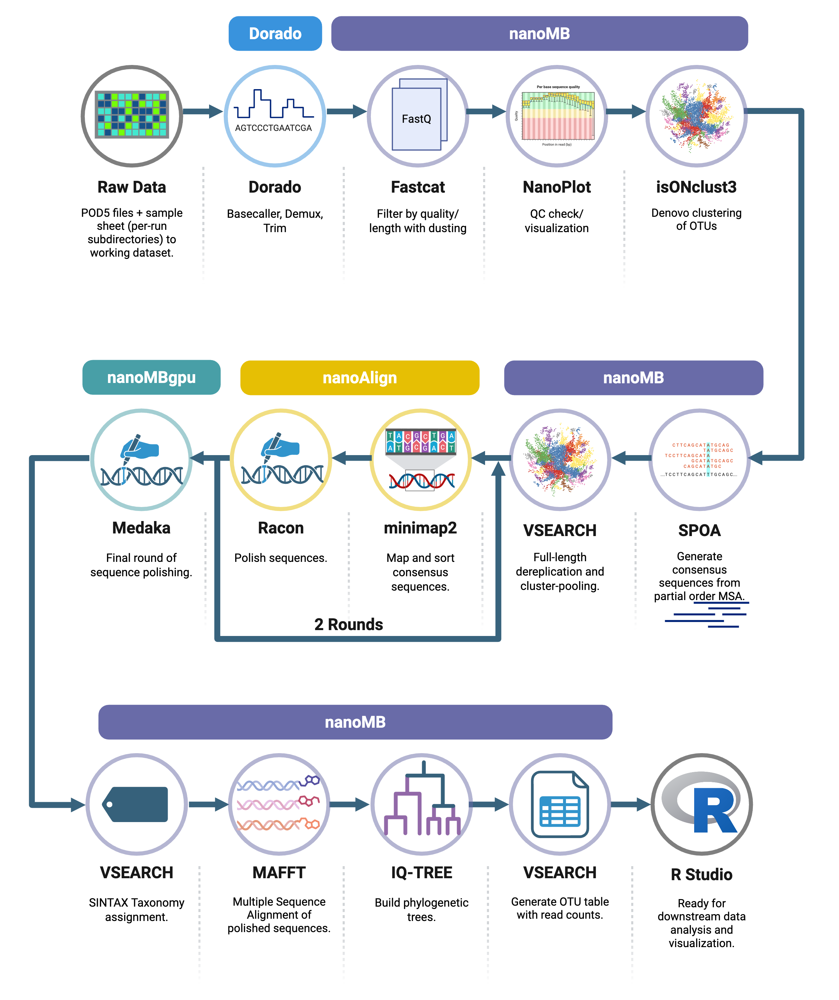

#  nanoMB: Oxford Nanopore 16S Pipeline

This workflow processes full-length Oxford Nanopore 16S amplicon reads — from raw POD5 files to polished, taxonomically annotated OTUs — using containerized tools optimized for the Swan HPC.
Execution runs entirely under Apptainer, ensuring consistent environments across GPU and CPU stages.

---

## 🧭 Overview

### 🧬 Pipeline Architecture



---

### Workflow summary

| Stage | Tool | Container | Notes |
|-------|------|------------|-------|
| Basecalling | **Dorado** | `docker:nanoporetech/dorado:latest` | GPU; ONT R10.4.1 SUP model |
| Demultiplexing | **Dorado demux** | `docker:nanoporetech/dorado:latest` | Uses ONT sample sheets |
| Trimming | **Dorado trim** | `docker:nanoporetech/dorado:latest` | Produces per-sample FASTQs |
| QC / Filtering | **Fastcat**, **NanoPlot** | `docker:aliciamrich/nanomb` | Q-score/length filters + QC reports |
| Clustering | **isONclust3** | `docker:aliciamrich/nanomb` | ONT-specific clustering |
| Consensus | **SPOA** | `docker:aliciamrich/nanomb` | Generates per-cluster consensus |
| Pooling / OTUs | **VSEARCH** | `docker:aliciamrich/nanomb` | Dereplication & clustering at 99%/97% |
| Mapping |	**Minimap2 + Samtools** |	`docker:aliciamrich/nanoalign:cpu` |	CPU-only alignment for polishing |
| Polishing |	**Racon × 2, Medaka** |	`docker:aliciamrich/nanoalign:cpu` (Racon) → `docker:aliciamrich/nanombgpu (Medaka)` |	Sequential polish: Racon × 2 + GPU Medaka |
| Taxonomy/Tree |	**VSEARCH SINTAX, MAFFT, IQ-TREE 2** |	docker:aliciamrich/nanomb:cpu |	Taxonomic classification + phylogeny |
| ASV option | **nanoASV** | `docker:aliciamrich/nanoasv` | *Third-party workflow disabled by default for 16S kits* |

---

### 🧩 Container Summary

| Container |	Image/Path  | Purpose/Key Tools |
|-----------|-------------|-------------------|
| `nanomb.sif`  | `/mnt/nrdstor/richlab/shared/containers/nanomb.sif` |	Core CPU environment (Fastcat, NanoPlot, isONclust3, SPOA, MAFFT, VSEARCH, IQ-TREE 2) |
| `nanoalign.sif` |	`/mnt/nrdstor/richlab/shared/containers/nanoalign.sif`  |	Lightweight CPU container for minimap2, samtools, and racon |
| `nanombgpu.sif` |	`/mnt/nrdstor/richlab/shared/containers/nanombgpu.sif`  |	GPU-based Medaka polishing  |
| `dorado.sif`  |	`/mnt/nrdstor/richlab/shared/containers/dorado.sif` |	Official ONT container for basecalling, demultiplexing, and trimming  |
| `nanoasv.sif`  |	`/mnt/nrdstor/richlab/shared/containers/nanoasv.sif`  |	Optional ASV workflow container (disabled by default) |

Note:
: All containers are automatically pulled (or locally referenced) via Apptainer and bound to Swan’s filesystem paths configured in [`profiles/hcc/config.yaml`](profiles/hcc/config.yaml).
: The apptainer-args ensure `/work`, `/lustre`, `/mnt/nrdstor`, and `/home` are available inside every environment.

---

### ⚙️ Directory Layout

Data and outputs are resolved from environment variables defined by  
[`profiles/hcc/env_setup.sh`](profiles/hcc/env_setup.sh).

| Variable | Typical path | Purpose |
|-----------|---------------|----------|
| `PROJ_ROOT` | `/mnt/nrdstor/richlab/shared/nanomb` | Shared repo with Snakefile |
| `WORK` | `/work/richlab/$USER` | Your Swan work directory |
| `NRDSTOR` | `/mnt/nrdstor/richlab/$USER` | Long-term storage |
| `OUT_ROOT` | `$WORK/datasets/16s` | Root for all datasets |
| `sampleset` | e.g. `loris` | Sample collection name |
| `dataset` | e.g. `culi` | Logical dataset under a sampleset |

####  Pipeline outputs land under:

```
$WORK/datasets/16s///
│
├── raw//                # demuxed + trimmed per-run reads
├── tmp/                 # intermediate results
├── qc/                  # QC reports
├── otu/                 # clustered OTUs, taxonomy, tree
└── asv/                 # ASV branch (placeholder if disabled)
```

---

## 🚀 Running on Swan

### 0. Log into your swan account

```bash
ssh username@swan.unl.edu
```

`enter your password and duo authentication`

### 0.5. Create Snakemake conda environment

You need to access the snakemake module through a [virtual conda environment](https://hcc.unl.edu/docs/applications/user_software/using_anaconda_package_manager/), but only on the first use. After that, you can load the same environment each time (see next).

```bash
module load anaconda
conda create -c conda-forge -c bioconda -c nodefaults -p $NRDSTOR/snakemake snakemake
conda activate $NRDSTOR/snakemake
conda deactivate
```

### 1. Load your environment

```bash
cd /mnt/nrdstor/richlab/shared/nanomb
source profiles/hcc/env_setup.sh
```

### 2.  Dry-run the workflow

```bash
module load anaconda
conda activate $NRDSTOR/snakemake
snakemake -np --profile profiles/hcc
```


### 3. Submit to SLURM

```bash
sbatch scripts/run_nanomb.sh
```

The orchestrator job stays light; each rule submits its own SLURM job via the profile.

Logs are written to
`/mnt/nrdstor/richlab/shared/nanomb/.snakemake/slurm_logs/.`


⸻

## 🧩 Configuration

All parameters live in [config/config.yaml](config/config.yaml).

### Key sections:

```yaml
# Identify this dataset
sampleset: loris
dataset:   culi
runs: [hdz1, hdz2, ..., hdz19]

# Data root
out_root: "$WORK/datasets/16s"

# References
itgdb_udb:   "/mnt/nrdstor/richlab/shared/databases/itgdb_16s/taxa_itgdb.udb"
silva_fasta: "/mnt/nrdstor/richlab/shared/databases/silva138/SILVA_138.2_SSURef_NR99_tax_silva.fasta"

# Disable ASV branch (recommended for ONT)
asv_method: none
```

⸻

## 🧠 Notes & Known Issues

- `spoa_consensus` requires temporary files with .fastq extension
(handled automatically in the current Snakefile).
- Racon ≥ 1.5.0 requires .sam/.paf files for overlaps; the Snakefile automatically converts .bam → .sam via `samtools view`.
- `nanoASV` is a third-party Snakemake pipeline currently disabled (`asv_method: none`) because ONT Dorado-trimmed reads typically fail cutadapt. If I manage to work out the bugs/mismatch in the future, then we may be able to activate this to extend funcitonality.
- Swan's SLURM configuration requires that GPU jobs (Dorado, Medaka) run on GPU partitions — I have configured the branching automatically in each rule.
- If you add new containers, update paths in [`config.yaml`](config/config.yaml) under `container_*`.
- For new container builds, reference Dockerfiles under [`docker/`](docker) (e.g., `docker/nanoalign/Dockerfile`).
- Re-run a failed rule safely with:

```bash
snakemake <rule> --profile profiles/hcc --rerun-incomplete
```


⸻

## 🧪 Typical Output Artifacts


| File  |	Description |
|-------|--------------------|
| otu/otus_centroids_99.fasta |	Primary OTU centroids (99 % identity) |
| otu/otus_centroids_97.fasta |	Secondary OTU centroids (97 % identity) |
| otu/otus_taxonomy.sintax |	Taxonomic annotations from VSEARCH SINTAX |
| otu/otu_references_aligned.fasta |	Multiple-sequence alignment (MAFFT) |
| otu/otu_tree.treefile	| Maximum-likelihood phylogeny (IQ-TREE 2) |
| otu/otu_table_merged.tsv  |	Merged per-sample OTU abundance table |
| qc/fastcat_file_summary.tsv |	Per-file QC summary from Fastcat |
| qc/fastcat_read_summary.tsv |	Per-read QC summary from Fastcat |
| qc/nanoplot/  |	NanoPlot read-length and quality plots |
| tmp/polished/polished_otus.fasta  |	Final Medaka-polished OTUs |
| asv/nanoasv/phyloseq.RData  |	Placeholder (empty if asv_method: none) |


⸻


##  🧰 Containers

All stages run inside Apptainer containers (bind mounts set in the profile):

| Container	| Path  |	Purpose / Key Tools |
|------------|------|---------------------|
| nanomb.sif  |	/mnt/nrdstor/richlab/shared/containers/nanomb.sif |	CPU environment (Fastcat, VSEARCH, isONclust3, SPOA, MAFFT, IQ-TREE 2, etc.)  |
| nanombgpu.sif |	/mnt/nrdstor/richlab/shared/containers/nanombgpu.sif  |	GPU tools (Racon × 2, Medaka polish)  |
| dorado.sif  |	/mnt/nrdstor/richlab/shared/containers/dorado.sif |	GPU basecalling, demultiplexing, and trimming with ONT Dorado |
| nanoasv.sif |	/mnt/nrdstor/richlab/shared/containers/nanoasv.sif  |	Optional ASV generation (disabled by default) |

*These are the container paths that all members of our lab account on Swan can access. You can load the container images into another location using the code below:*

```bash
module load apptainer

apptainer build nanomb.sif docker:aliciamrich/nanomb
apptainer build nanombgpu.sif docker:aliciamrich/nanombgpu
apptainer build nanoalign.sif docker:aliciamrich/nanoalign
apptainer build nanoasv.sif docker:aliciamrich/nanoasv
apptainer build dorado.sif docker:nanoporetech/dorado:latest

```

---

##  🧾 Citation

If you use this workflow in analyses or teaching:

Rich Lab (2025). nanoMB: container-based ONT 16S processing pipeline.

---


Author
: Alicia M. Rich, PhD

License
: MIT (open for teaching and research use)


---

